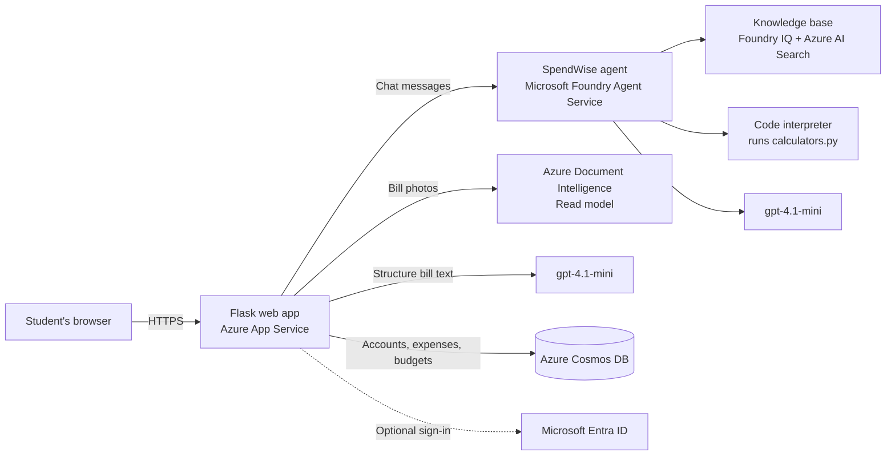

# SpendWise: AI Personal Finance Tutor

SpendWise is a personal finance tutor and expense tracker for college students in India. You can ask it anything about money, track what you spend by uploading a bill or simply telling the chat, set a budget for each month, and get exact numbers from built-in calculators.

Built for the **AI-103: Develop AI Apps and Agents on Azure** course at Chitkara University.

- **Live site:** https://spendwiseai-foundry.azurewebsites.net
- **Demo video:** 

## Team

Piyush Goel 
Aditya Kashyap
Aryan Saini 
Anjal Sharma
Ekesh Pal Singh

---

## 1. Problem statement

Most students start managing money for the first time in college, usually with a fixed allowance, a stipend or part-time income. They have real questions ("Should I buy this laptop on EMI or save for it?", "What's a recurring deposit?", "How much of my money went on food this month?") but:

- Most finance apps are built for working professionals, not students.
- Generic chatbots explain concepts, but often get the maths wrong, and can suggest risky options without thinking about the time frame.
- Tracking spending by hand is tedious, so most students simply don't do it.

## 2. Our solution

SpendWise brings three things together in one place:

1. **An AI tutor** that explains finance in plain language, grounded in a knowledge base we wrote for Indian students, and that stays on the topic of money.
2. **An expense tracker** where you can upload a photo of a bill or a handwritten list, check what was read, and save it. You can also just type "I spent 200 on Fanta today" in the chat and it gets added automatically.
3. **Exact calculators** for EMI, fixed and recurring deposits, savings goals, the 50/30/20 budget split and SIPs. The same calculation code is used by the calculator cards and by the AI agent, so the numbers always match.

Each user has their own account, and their expenses and monthly budgets are stored privately in the cloud.

---

## 3. Architecture



### How the main features flow

**Asking a question**
1. The browser sends the message to our Flask app.
2. The app forwards it to our agent in Microsoft Foundry, inside that user's own conversation, so the agent remembers earlier messages.
3. The agent searches the knowledge base (Foundry IQ on Azure AI Search), and uses Code interpreter to run our `calculators.py` whenever an exact number is needed. It never does the maths "in its head".
4. The reply, and any chart the agent drew, comes back to the browser.

**Logging an expense from the chat**
1. The user says something like "I spent 200 on Fanta today".
2. The agent replies with one short sentence and adds a hidden line: `EXPENSE_JSON: {...}`.
3. Our server removes that line from the reply, checks it (positive amount, category from our fixed list, real date), saves it to Cosmos DB, and the browser shows an "Added to tracker" card with an **Undo** button.

**Scanning a bill or a handwritten list**
1. The photo goes to **Azure Document Intelligence (Read model)**, which reads every line of text, printed or handwritten, with a confidence score for each word.
2. Our code rebuilds the rows using the position of each piece of text on the page, so an item is never paired with the amount from another row.
3. **gpt-4.1-mini** turns those rows into expenses: item, amount, date, category and need or want.
4. The user sees a **"Check before saving"** table. Rows Azure wasn't confident about are highlighted in yellow, and every field can be edited. Nothing is saved until the user confirms.

**Signing in**
- Users sign up with name, email and password. Only a secure hash of the password is stored (Werkzeug's password hashing), never the password itself.
- A "Continue with Microsoft" option using Microsoft Entra ID is built in as well (see Known limitations).

---

## 4. Technology stack and AI services

| Part | What we used |
| --- | --- |
| AI agent | **Microsoft Foundry Agent Service** |
| Language models | **gpt-4.1-mini** (agent, bill structuring, categories), **text-embedding-3-small** (knowledge base) |
| Knowledge / RAG | **Foundry IQ** knowledge base on **Azure AI Search** (Free tier), 47 finance notes, agentic retrieval |
| Exact calculations | Foundry **Code interpreter** tool running our `calculators.py` |
| Bill reading (OCR) | **Azure Document Intelligence**, prebuilt Read model |
| Database | **Azure Cosmos DB for NoSQL** (free tier) |
| Hosting | **Azure App Service** (Linux, Python 3.12) |
| Authentication | Email and password (hashed), plus **Microsoft Entra ID** via MSAL |
| Backend | Python, Flask, gunicorn |
| Frontend | HTML, CSS and plain JavaScript (no framework) |

### How the website authenticates to Azure

- **Foundry agent:** on a laptop it uses `az login`. On App Service it uses the website's **Managed Identity**, which has the **Foundry User** role on our Foundry resource. No key for the agent is stored anywhere.
- **Document Intelligence, the chat model for bill structuring, and Cosmos DB:** keys stored as environment variables (in `.env` locally, and in App Service settings when deployed). `.env` is listed in `.gitignore`, so no credentials are ever uploaded to GitHub.

---

## 5. Project structure

```
SpendWise/
├── app.py                 Web server: pages, sign-in, chat, tracker API, calculators
├── foundry_agent.py       Sends chat messages to the Foundry agent, returns replies and charts
├── auth.py                Email/password accounts and "Continue with Microsoft"
├── database.py            Reads and writes users, expenses and budgets in Cosmos DB
├── receipt_reader.py      Document Intelligence OCR + model that structures the bill
├── calculators.py         EMI, RD, FD, savings goal, 50/30/20 and SIP maths
├── requirements.txt
├── .env.example           Template for the settings the app needs
├── templates/
│   ├── index.html         Main page: chat, expense tracker, calculators
│   └── login.html         Sign in / sign up page
├── static/
│   ├── style.css
│   └── script.js          Chat, tracker, month picker, editing, calculators
└── foundry_setup/         What lives in Foundry, kept here for reference
    ├── agent_instructions.txt   The agent's full instructions
    └── knowledge_files/         The 47 notes in the knowledge base
```

---

## 6. Setup instructions

### What you need
- An Azure subscription (we used Azure for Students)
- Python 3.12 or newer
- Azure CLI (`winget install -e --id Microsoft.AzureCLI` on Windows)

### Azure resources
1. **Microsoft Foundry** project with **gpt-4.1-mini** and **text-embedding-3-small** deployed.
2. **Azure AI Search** (Free tier), connected in Foundry under Knowledge.
3. A **knowledge base** in Foundry: upload the files in `foundry_setup/knowledge_files`.
4. An **agent** in Foundry:
   - Model: gpt-4.1-mini
   - Instructions: paste `foundry_setup/agent_instructions.txt`
   - Tools: add **Code interpreter** and upload `calculators.py` to it
   - Knowledge: connect the knowledge base
   - Make sure **Web search is not added**
5. **Azure Cosmos DB for NoSQL** account, with the free tier applied. The app creates the database and containers itself on first run.
6. Document Intelligence uses the same Foundry resource's endpoint and key.

### Run it on your computer
```bash
python -m venv venv
venv\Scripts\activate            # on Mac/Linux: source venv/bin/activate
python -m pip install -r requirements.txt
az login
```
Copy `.env.example` to `.env` and fill in the values (endpoints, keys, agent name and the agent's current version number). Then:
```bash
python app.py
```
Open **http://localhost:5000**. Use `localhost`, not `127.0.0.1`, since sign-in cookies are tied to the address.

> Whenever you click **Save** on the agent in Foundry, its version number goes up. Update `AGENT_VERSION` in `.env` and restart, otherwise the website keeps using the older version.

### Deploy to Azure App Service
From a copy of the project without `venv` and `.env`:
```bash
az webapp up --name spendwiseai-foundry --resource-group genai --location uaenorth --runtime "PYTHON:3.12" --sku B1
az webapp config set --name spendwiseai-foundry --resource-group genai --startup-file "gunicorn --bind=0.0.0.0 --timeout 600 --workers 1 app:app"
```
Add the `.env` values as App Service settings, then give the website permission to use the agent:
```bash
az webapp identity assign --name spendwiseai-foundry --resource-group genai
az role assignment create --assignee-object-id <principalId> --assignee-principal-type ServicePrincipal --role "Foundry User" --scope <Foundry resource id>
az webapp restart --name spendwiseai-foundry --resource-group genai
```
We use one gunicorn worker because each user's link to their Foundry conversation is kept in memory.

---

## 7. Testing and results

We tested each feature as we built it, and several of the biggest improvements came directly from things that went wrong during testing.

### Calculations
We checked the calculator outputs against the formulas, then asked the agent the same questions to make sure it runs our code instead of estimating.

| Test | Expected | Result |
| --- | --- | --- |
| EMI: ₹45,000 at 10% for 12 months | ₹3,956.21 | Calculator card and agent both gave ₹3,956.21. The Foundry playground showed Code interpreter loading `calculators.py` and calling `calculate_emi` |
| FD: ₹10,000 at 7% for 1 year | ₹10,718.59 | Matches |
| SIP: ₹2,000/month at 12% for 10 years | ₹4,64,678.15 | Matches |
| 50/30/20 split of ₹20,000 | ₹10,000 / ₹6,000 / ₹4,000 | Matches |

### Problems we found, and how we fixed them

| What we tested | What went wrong | What we changed |
| --- | --- | --- |
| "How do I save 50k for a laptop?" | The tutor listed a SIP, a market-linked investment, for a short-term goal | Added a rule that matches options to the time frame: only low-risk options (monthly saving, RD, FD, EMI) for goals within about 3 years |
| "Favourite cricketer" | The tutor answered a non-finance question | Added a "stay on topic" rule: it politely declines and suggests a finance question instead |
| "I spent 199 on Fanta", then "add to my tracker" | The agent asked several follow-up questions instead of logging it | Rewrote the logging rule: log straight away, choose the category itself, reply in one sentence |
| Fanta logged as "Eating out" | No category for drinks and snacks | Added a "Snacks and drinks" category, with clear rules for Snacks vs Eating out vs Groceries |
| Handwritten list of 5 expenses | Document Intelligence's **receipt** model skipped one row (FOOD) and couldn't give each row its own date | Switched to the **Read** model plus the chat model, and added a Date column to the review table |
| Same handwritten list, second try | "Glasses" was saved as a second "Laptop", because the page's columns were read separately | We now rebuild each row from the position of the text on the page before the model sees it |
| Expense totals | Totals only counted the current month, so they didn't match the table | Added a month picker: totals, budget and table always show the same month, or All time |
| Budgets | One budget applied to every month | Each month now has its own budget in Cosmos DB |

### Security and data privacy checks
- A user can only see, edit or delete their own expenses and budgets. The user id always comes from the signed-in session, never from the browser.
- A wrong password and an unknown email give the same message, so the page never reveals who has an account.
- Passwords are stored only as hashes (we checked the `users` container in Cosmos DB Data Explorer).
- Every expense, from any source, is validated before saving: positive amount, category from a fixed list, real date.

---

## 8. Responsible AI

- **Not financial advice.** The agent is told it's a learning tool: it doesn't recommend specific stocks or funds, and suggests checking with a bank or qualified advisor for big decisions. It never asks for bank details, OTPs, PINs or passwords.
- **Grounded answers.** The agent answers from our knowledge base first, and says so honestly when the notes don't cover something.
- **Exact numbers.** Calculations always run in Code interpreter using our tested code.
- **Suitable suggestions.** Options are matched to the user's time frame and risk (no market-linked investments for short-term goals).
- **Human in the loop.** Scanned bills are never saved automatically. Uncertain rows are highlighted, and everything can be edited first. Expenses logged from the chat can be undone or edited.
- **Privacy.** Each user's data is kept separate in Cosmos DB and encrypted at rest by Azure. The "Ask SpendWise for tips" feature only sends a summary of totals, and only when the user clicks it.
- **Staying in scope.** We removed Web search from the agent, because it sends data outside the Azure compliance boundary, and the agent declines questions unrelated to money.

---

## 9. Known limitations

- **Microsoft sign-in doesn't complete for personal Microsoft accounts yet.** The flow is built, and Microsoft shows the permission screen, but after accepting, Microsoft's login server returns a `server_error` with no details. Email sign-up works fully in the meantime.
- **Handwriting and blurry photos** are still harder to read than printed bills. The review table and highlighting are there for exactly this reason.
- **Categories are chosen by the model**, so it can occasionally pick one a user wouldn't. Any expense can be edited.
- **Chat conversations are linked to users in memory.** A server restart starts a fresh conversation (saved expenses aren't affected), and the app runs on a single worker.
- **The RD calculator compounds monthly** to keep the code simple, while many banks compound quarterly, so results can differ slightly from a bank's.
- **Payment limits** (UPI, NEFT, RTGS, IMPS, cash) in the knowledge base were correct when written, but banks and the RBI update them. Always check your own bank's current limits.
- **The Foundry User role** given to the website is broader than it strictly needs.
- There's no password reset or rate limiting on sign-in yet.

## 10. Future improvements

- Fix Microsoft sign-in for personal accounts, and add Google sign-in.
- Connect the agent to Cosmos DB (Foundry has a Cosmos DB tool) so users can ask "How much did I spend on food in August?" and the agent looks it up itself.
- Run Foundry **Evaluations** (groundedness, relevance) on a fixed set of test questions, and turn on **Guardrails** such as prompt shields.
- Use a Managed Identity for Cosmos DB and Document Intelligence too, so no keys are needed at all, and tighten the agent permission to a least-privilege role.
- Charts in the tracker (spending by category over time), a debt tracker, and exporting expenses to Excel.
- Publish the agent to Microsoft Teams.

---

## 11. Acknowledgements

- **Microsoft Azure and Microsoft Foundry** services listed in section 4.
- **Python libraries:** Flask, Werkzeug, gunicorn, python-dotenv, OpenAI Python SDK, Azure AI Projects SDK, Azure Identity, Azure AI Document Intelligence SDK, Azure Cosmos DB SDK, and MSAL for Python.
- **Fonts:** Fraunces and Inter, from Google Fonts.
- **Knowledge base:** the 47 finance notes were written for this project with the help of AI assistants and checked by the team. Payment limits were checked against publicly available information at the time of writing.
- **AI assistance:** as allowed by the project guidelines, we used AI assistants while building. Every part of the project has been reviewed and can be explained by the team.
